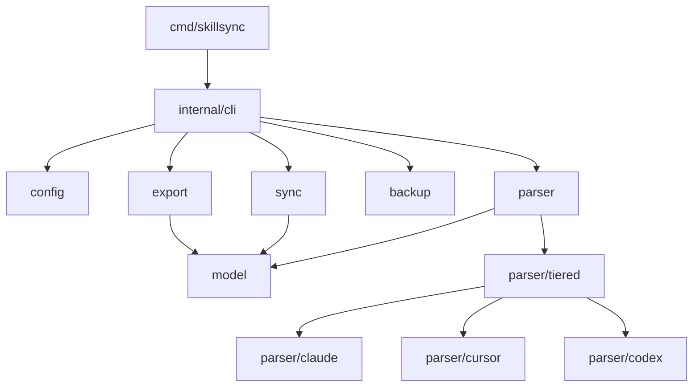

# Architecture

## Package Dependencies



## Core Interfaces

**Parser** (`internal/parser/parser.go`):

```go
type Parser interface {
    Parse() ([]model.Skill, error)
    Platform() model.Platform
    DefaultPath() string
}
```

**Platform**: `ClaudeCode | Cursor | Codex` (`internal/model/platform.go`)

**Strategy**: `overwrite | skip | newer | merge | three-way | interactive`
(`internal/sync/strategy.go`)

## Data Flow

1. CLI command invoked
2. Parser discovers skills from platform config
3. Sync applies strategy to merge skills
4. Export writes to target format
