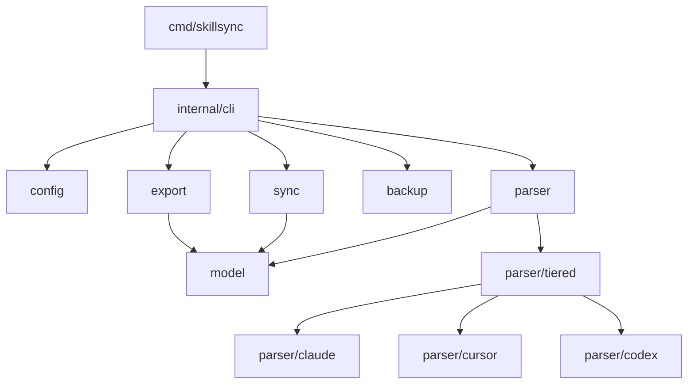

# Architecture

## Package Dependencies



## Core Interfaces

**Parser** (`internal/parser/parser.go`):

```go
type Parser interface {
    Parse() ([]model.Skill, error)
    Platform() model.Platform
    DefaultPath() string
}
```

**Platform**: `ClaudeCode | Cursor | Codex` (`internal/model/platform.go`)

**Strategy**: `overwrite | skip | newer | merge | three-way | interactive`
(`internal/sync/strategy.go`)

## Data Flow

1. CLI command invoked
2. Parser discovers skills from platform config
3. Sync applies strategy to merge skills
4. Export writes to target format

## Command-Aware Extension

Command/prompt artifacts are represented in the same unified `model.Skill`
structure using:

- `Type`: `skill` or `prompt`
- `Trigger`: optional slash trigger (for example `/review`) when source platform
  exposes one
- `Metadata`: passthrough for platform-specific fields that are not universally
  portable

### Discovery

- `discover` can return both skills and prompts; filtering is handled via the
  existing `--type` flag.
- Parser implementations are responsible for assigning `Type=prompt` for
  command/prompt artifact sources (for example Claude `.claude/commands/*.md`).

### Sync/Delete Behavior

- Sync planning and execution operate on typed artifacts.
- Command-aware sync is opt-in for mutation commands (`sync`, `delete`) via
  type filters so default behavior remains skills-focused and backward-compatible.

### Precedence and Conflict Notes

- Platform-native precedence rules remain authoritative (for example
  Claude same-name skill overrides command).
- Cross-platform conflict identity is based on normalized artifact name + type,
  with trigger differences surfaced as conflict/warning context for prompt
  artifacts.
