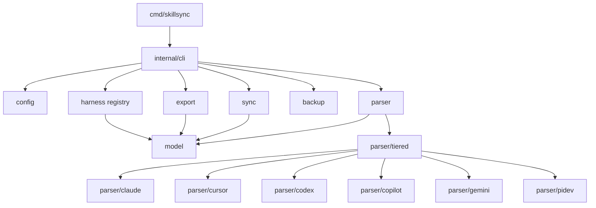

# Architecture

## Package Dependencies


```mermaid
graph TD
    cmd[cmd/skillsync] --> cli[internal/cli]
    cli --> config[config]
    cli --> parser[parser]
    cli --> sync[sync]
    cli --> harness[harness registry]
    cli --> backup[backup]
    cli --> export[export]
    parser --> model[model]
    sync --> model
    export --> model
    parser --> tiered[parser/tiered]
    tiered --> claude[parser/claude]
    tiered --> cursor[parser/cursor]
    tiered --> codex[parser/codex]
    tiered --> copilot[parser/copilot]
    tiered --> gemini[parser/gemini]
    tiered --> pi[parser/pidev]
    harness --> model
```

## Core Interfaces

**Parser** (`internal/parser/parser.go`):

```go
type Parser interface {
    Parse() ([]model.Skill, error)
    Platform() model.Platform
    DefaultPath() string
}
```

**Platform**: `ClaudeCode | Codex | Cursor | Copilot | Gemini | Pi`
(`internal/model/platform.go`) — six canonical harnesses. The harness registry
owns aliases, canonical write roots, discovery precedence, parser selection,
and supported artifact surfaces. Legacy Pi spellings resolve to `Pi` with an
advisory deprecation warning; they are not separate implementations.

See `docs/platforms/` for per-platform format references and `docs/platforms/cross-platform-mapping.md` for conversion rules.

**Strategy**: `overwrite | skip | newer | merge | three-way | interactive`
(`internal/sync/strategy.go`)

## Data Flow

1. CLI command invoked
2. Harness registry resolves the canonical adapter and ordered roots
3. Parser discovers skills from platform config and attaches conformance issues
4. Sync validates and applies the selected merge strategy
5. Export writes the shared core plus explicitly mapped target fields

## Shared Agent Skills Core

Directory bundles are the common unit across all six adapters. The shared model
keeps the standard scalar fields, nested standard metadata, supporting bundle
files, raw source frontmatter for same-harness round trips, and structured
conformance issues. Discovery reports invalid bundles instead of hiding them;
write operations reject them unless `--skip-validation` is explicit.

## Transport-Layer Prompt Support

Command/prompt artifacts are represented in the same unified `model.Skill`
structure using:

- `Type`: `skill` or `prompt`
- `Trigger`: optional slash trigger when the source platform exposes one
- `Metadata`: passthrough for platform-specific fields that are not universally
  portable

This is a transport model, not a claim of runtime parity. SkillSync does not
introduce first-class `command` or `agent` entities for Codex, and it does not
imply that Codex can reproduce Claude command triggers or subagent behavior.

## Portability Boundaries

The architecture docs use the same portability classes as the platform docs:

- **Portable**: `SKILL.md` content plus supporting directories that fit the
  shared Agent Skills subset.
- **Partially portable**: prompt/command artifacts and always-on instruction
  files, where content survives but runtime semantics differ by platform.
- **Non-portable**: unmapped agent/subagent behavior, plugin/package provenance,
  and other runtime-owned behavior with no common cross-platform file model.

Native plugins, packages, and extensions use `model.NativePackage`. They do not
use `model.Skill`. The `internal/native` package keeps discovery and writes off
by default. A caller must enable native synchronization, allow the
`native-config` trust category, and register an exact identity mapping before a
cross-harness write. A matching name does not imply portability.

Native custom agents use `model.CustomAgent` and `internal/agents`. They do not
use `model.Skill`. Discovery and writes are off by default. Claude, Copilot,
and Gemini support native Markdown codecs. Cross-harness writes require
`native-config` trust and an exact directional mapping. The planner removes
source-only native fields, reports the loss boundary, validates the full batch,
and calls the writer once. Codex, Cursor, and Pi are explicit unsupported
targets because their instruction, mode, and prompt surfaces are not native
agent equivalents.

This means the unified model is intentionally conservative:

- it preserves content and source metadata for lossy conversions
- it does not claim that `Type=prompt` recreates native slash-command behavior
- it models native agent files separately and does not claim portable runtime parity

### Discovery

- `discover` can return both skills and prompts; filtering is handled via the
  existing `--type` flag.
- Parser implementations are responsible for assigning `Type=prompt` for
  command/prompt artifact sources (for example Claude `.claude/commands/*.md`).

### Sync/Delete Behavior

- Sync planning and execution operate on typed artifacts.
- Command-aware sync is opt-in for mutation commands (`sync`, `delete`) via
  type filters so default behavior remains skills-focused and backward-compatible.

### Precedence and Conflict Notes

- Platform-native precedence rules remain authoritative (for example
  Claude same-name skill overrides command).
- Cross-platform conflict identity is based on normalized artifact name + type,
  with trigger differences surfaced as conflict/warning context for prompt
  artifacts.
